Research questions, Section 1
1	What is LUKS and what is its relationship to dm-crypt in the Linux kernel? Explain the role of the device mapper in the encryption process.
LUKS is a Linux disk-encryption standard that manages keys, while dm-crypt performs encryption in the kernel using the device mapper to create a virtual encrypted block device.
2	What is the difference between full disk encryption (FDE) and filesystem-level encryption? List two advantages and two limitations of each.
FDE encrypts the entire disk for full protection but unlocks after boot, while filesystem encryption protects selected files with per-user control but exposes some metadata.
3	What is LVM and what are its three layers of abstraction (PV, VG, LV)? What advantages does LVM offer over traditional partitioning in a server environment?
LVM manages storage using Physical Volumes , Volume Groups , and Logical Volumes, allowing flexible resizing, snapshots, and easier server storage management.
4	Explain what happens during the boot process of a system with LUKS+LVM: at what point is the decryption password requested and what role does GRUB play in this process?
GRUB loads the kernel and initramfs, which requests the LUKS passphrase early in boot; after unlocking, LVM activates volumes and mounts the root filesystem.

Evidence photos
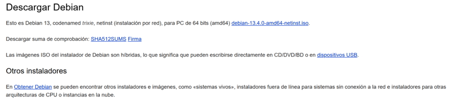
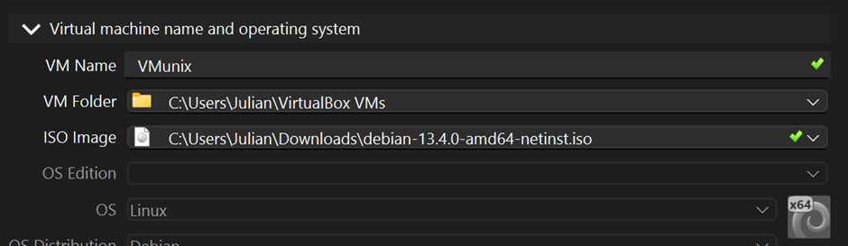
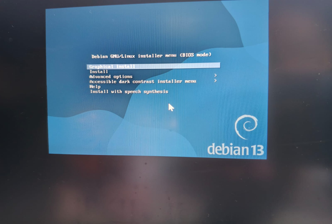
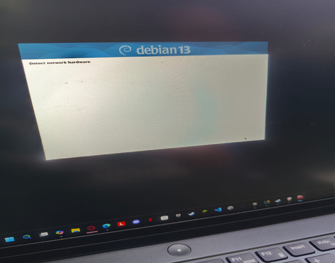
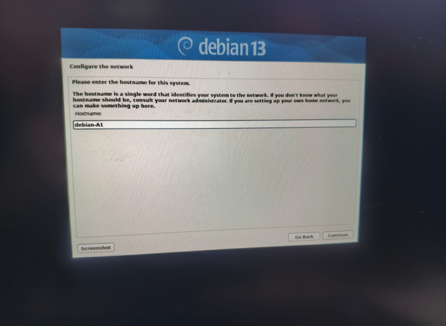
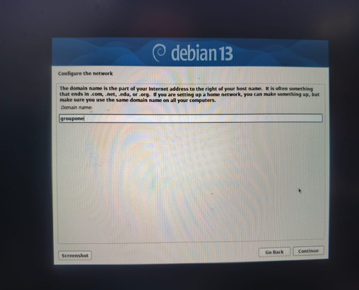
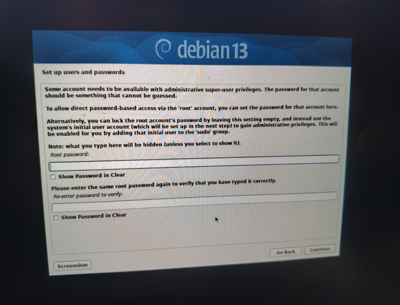
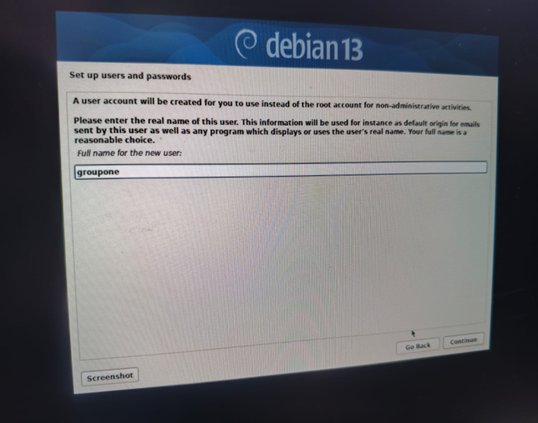
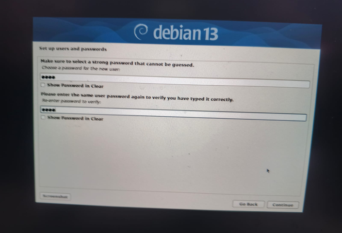
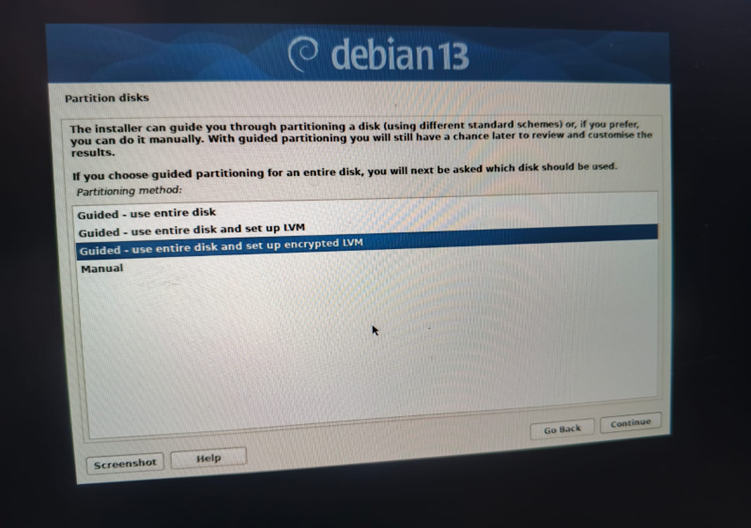
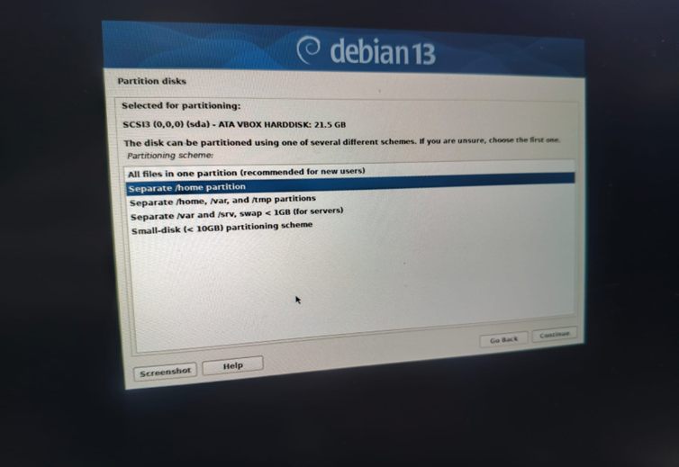
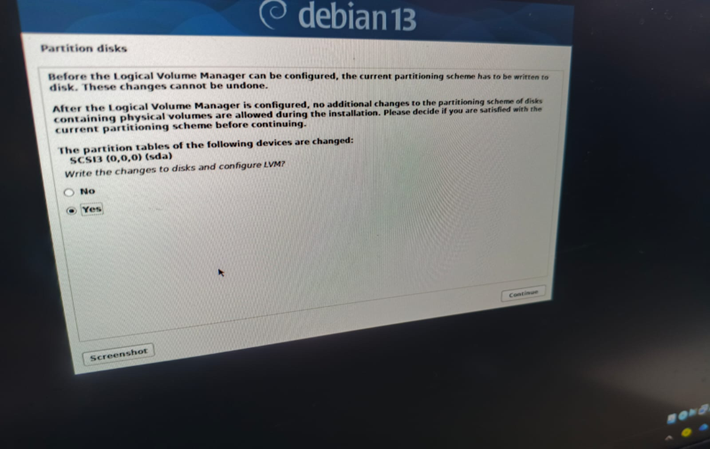
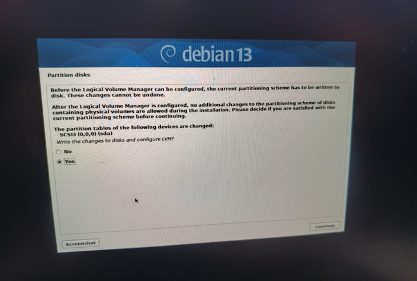
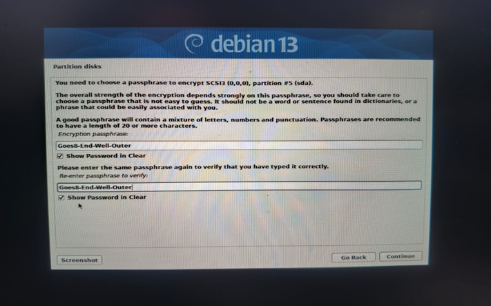
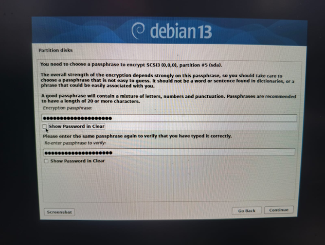
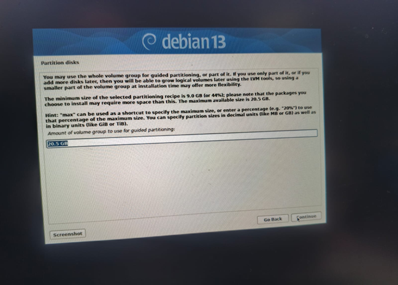
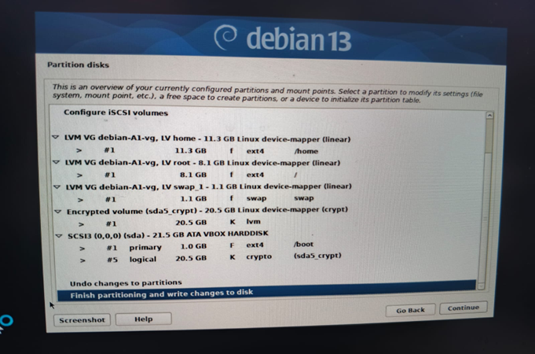
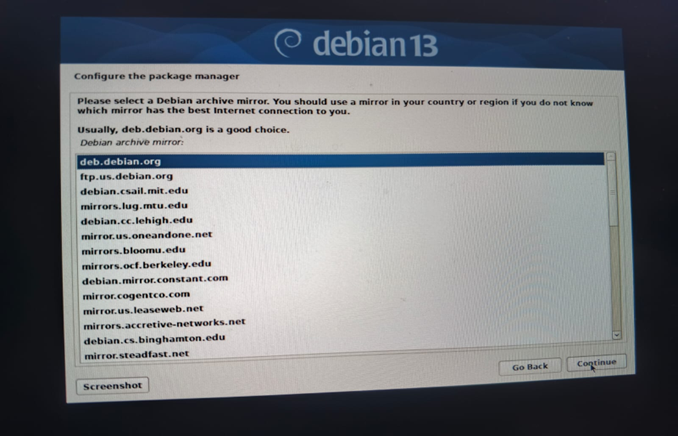
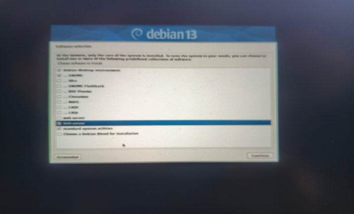
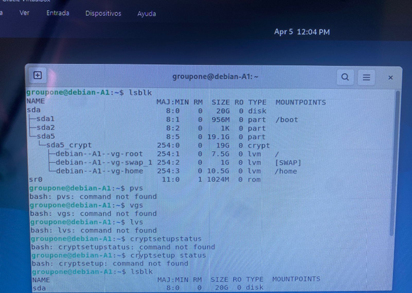