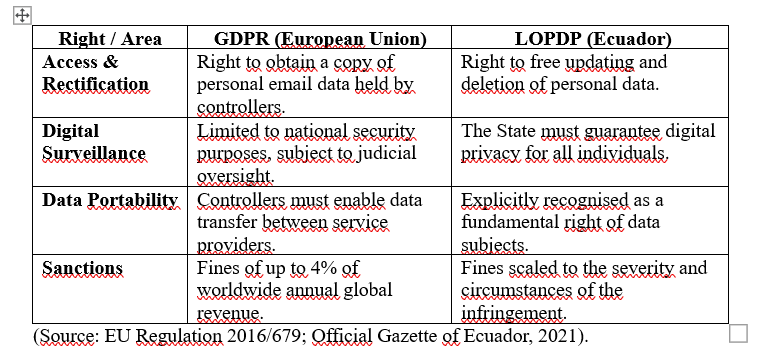

What is asymmetric encryption (public/private key) and how does it work in the context of GPG? What is the difference between encrypting a message and digitally signing it?
Asymmetric encryption uses a public key for encryption and a private key for decryption. In GPG, this ensures that only the intended recipient can read the message.
Difference: Encryption protects privacy (no one reads the message), while digital signatures protect identity (no one can pretend you sent it) (GnuPG Project, 2024).
2. Compare ProtonMail, Gmail, and Outlook in terms of: (a) encryption at rest, (b) encryption in transit, (c) end-to-end encryption, (d) provider privacy and data access policies, and (e) legal jurisdiction.
ProtonMail uses “zero-access” encryption under Swiss law, which prevents even them from viewing your data. Gmail and Outlook encrypt data in transit and at rest, but since they are based in the U.S. and manage the keys, they can access the data due to legal requirements or for system functions (Electronic Frontier Foundation [EFF], 2023).
3.	What is the Certificate Authority (CA)-based PKI model, and list two advantages and two disadvantages compared to the Web of Trust?
PKI uses central authorities (CAs) as “judges” of identity, while the Web of Trust (WoT) relies on users validating other users.
•	PKI Advantages: It is the standard for websites (HTTPS) and is automatic for the user.
•	PKI Disadvantages: If a central authority is hacked, thousands of sites are compromised at once (DigiCert, 2024).
4.	Research the EU General Data Protection Regulation (GDPR) and Ecuador's Organic Law on Personal Data Protection. What rights do they grant citizens regarding email and digital surveillance? (Create a comparative table.)

5.	What is email metadata? Why doesn't content encryption protect metadata, and what are the implications for privacy?
Metadata is the “envelope” of the message (who sent it, time, IP address). GPG does not encrypt it because servers need it to route the email. Implication: Metadata enables user profiling. Knowing who you talk to and at what time is just as revealing as reading the message’s content (Privacy International, 2023).

Reflection: Through this section, we have come to understand that security in digital communication is not a luxury, but a technical and legal necessity. The use of GPG allows us to guarantee authenticity—ensuring we know who sent the message—and confidentiality, ensuring that no one else can read it.
In the context of our country, the implementation of the LOPDP marks an important milestone, but as technologists, we have seen that technology must go hand in hand with the law to ensure true protection against mass surveillance and the misuse of metadata.